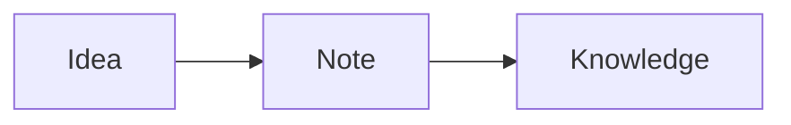

# Getting Started with KBOS

KBOS is built around a single principle: **your knowledge, your files**.
Everything is stored as Markdown on disk. No database, no vendor lock-in.

## Navigation

| Action | How |
|--------|-----|
| Open note | Click in the file tree, or search |
| New note | `Ctrl+K` → New note |
| Back / Forward | `Alt+←` / `Alt+→` |
| Command palette | `Ctrl+K` |
| AI assistant | `Ctrl+Shift+A` or click **Ask AI** |
| Toggle sidebar | Menu icon in the top-left |

## Writing notes

Notes are standard Markdown with some extras:

### Wikilinks

Link to another note by name:

:::example
See also [[project-plan]] and [[research/market-analysis]].
:::

### Embeds — include another note inline

:::example
![[getting-started]]
![[meeting-notes#Action items]]
:::

The `![[note]]` syntax renders the full content of that note inline.
Add a heading anchor (`#Section`) to embed just one section.
See **Document Embeds** in this guide for more.

### Callout blocks

:::example
> [!NOTE]
> Something the reader should be aware of.

> [!TIP]
> A helpful suggestion.

> [!WARNING]
> Something that could go wrong.
:::

See **Callout Blocks** in this guide for all types.

### Task lists

:::example
- [x] Completed task
- [ ] Pending task
- [ ] Another item
:::

### Diagrams (Mermaid)

:::example

:::

### Frontmatter

Every note can have YAML frontmatter for metadata:

```yaml
---
title: My Note
tags:
  - project
  - work
status: active
---
```

## Views and modes

### Editor modes

Each note has three view modes (toolbar icons in the note header):

| Icon | Mode |
|------|------|
| ✏️ | Edit only |
| 👁 | Preview only |
| ⬛⬜ | Side-by-side (default) |

### Split view

Click the **⬜⬜** icon in the tab bar to open a second pane.
Enable **Sync scroll** to mirror scrolling between panes.

### Tabs

Open multiple notes in tabs. Right-click a file in the tree to open in a new tab or split.

## Search

The search box supports several query formats:

| Query | Finds |
|-------|-------|
| `meeting notes` | Full-text search |
| `#docker` or `tag:docker` | Notes with that tag |
| `folder:projects` | Notes in a folder |

## AI assistant

Click **Ask AI** or press `Ctrl+Shift+A` to open the AI chat panel.

The AI has access to your vault content and can:
- Answer questions based on your notes
- Summarize a document or folder
- Suggest related notes
- Help you write or edit content

The scope selector (Vault / Folder / Document) controls how much context the AI sees.

:::example
> [!TIP]
> For best results, ask specific questions: *"What did we decide about the API design in the architecture notes?"*
:::

## Password manager

Click **Passwords** in the toolbar (or bottom nav on mobile) to access the built-in password vault.

- Secrets are encrypted with AES-256-GCM
- TOTP (two-factor) codes are generated client-side
- Entries can be private or shared with the team

## Bookmarks

Save external URLs with tags and descriptions. Access via the **Bookmarks** view.

## Tasks

Create and track tasks with priorities, due dates, and team visibility. Access via the **Tasks** view.

## Journal

Click the journal icon (or `Ctrl+K` → Journal) to create daily, weekly, or monthly journal entries from templates.

## Knowledge graph

Click the graph icon in the toolbar to visualise how your notes connect through wikilinks.

## Keyboard shortcuts

| Shortcut | Action |
|----------|--------|
| `Ctrl+K` | Command palette |
| `Ctrl+Shift+A` | AI assistant |
| `Ctrl+S` | Save note |
| `Alt+←` | Navigate back |
| `Alt+→` | Navigate forward |
| `Escape` | Close panel / clear search |

## Code blocks

Code blocks support syntax highlighting for 50+ languages.
Click the **palette icon** in a code block header to switch themes (VS Code Dark+, Dracula, Night Owl, GitHub, Nord, and more).
Toggle **line numbers** and **word wrap** with the icons in the header.

```typescript
// Example: TypeScript with VS Code Dark+ theme
function greet(name: string): string {
  return `Hello, ${name}!`;
}
```

## Settings (admin only)

Click your username → Settings to configure:
- Vault name and paths
- Authentication mode (public / local login)
- AI provider (OpenAI-compatible endpoint, model, embedding model)
- UI preferences (autosave interval, theme)
- Multi-vault management

## Multi-vault

KBOS supports multiple vaults. Switch between them using the vault selector in the toolbar.
Each vault has its own notes, config, and ACL (admin / editor / reader roles).
